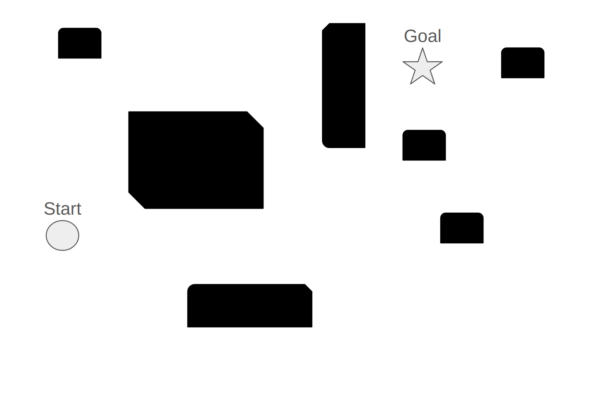
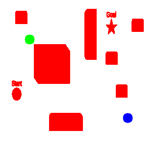
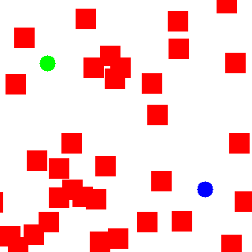

# Roomba Robot Pathfinding Simulator

## Overview

This project simulates pathfinding for a Roomba-like robot in a pre-mapped environment. The environment is represented by an occupancy grid where each cell indicates the presence of an obstacle or free space. The program calculates a collision-free path from a starting position to a goal position.

## System Description

### Grid

The origin of the occupancy grid is at the top left of the image. The positive x-axis is to the right and the positive
y-axis is downward. The grid is of size `320 x 320` with a resolution of `0.05 m`(resolution can be adjusted). The `OccupancyGrid` class has methods to set occupancy for a given coordinate.

### Grid Generator
There are two ways to generate the grid. You could use an image of a grid with generateOccupancyGridFromImage. For example 

**Image Used for Grid Generator**

**Generated Grid**

Or you can use the GenerateGrid function to generate a random grid which generates a grid similar to this

**Randomly Generated Grid**

They both generate a grid that can be used to simulate a real-world grid

### Robot

The robot is a spherical robot of diameter `0.6m`(the diameter can be adjusted) and it operates with a 2d coordinate system with $(x.y. \theta)$ where $\theta$ is the yaw(orientation) of the robot. The robot could rotate 360 degrees in place.

### Path Planner
The PathPlanner I have implemented uses the A* method to find a path in a grid. In this approach, the neighbors are selected based on whether the robot could travel to the neighbor point (by doing a robot size projection).

This problem has mainly three subproblems that need addressing
1. Path Planning in a grid
2. How to deal with the mismatch in grid resolution and robot diameter
3. Smoothning the generated path

#### Path Planning in a Grid
For this part, I decided to assume that the current Occupancy Grid is a 2D graph, and any Single Source Shortest Path algorithm will technically work. I decided to go  with A*, as A* combines features of Dijkstra's Algorithm (which is efficient but can be slow because it explores all directions equally) and the Greedy Best-First-Search  (which is fast but can be inaccurate). 

#### Tackling Grid Resolution and robot Diameter
There were two approaches available to me for solving this problem, The first one was inflating the obstacles in the grid; after iterating through the entire grid and inflating the obstacles by marking the cells which are a diameter radius away from them as occupied. This approach although promising will be very compute expensive as it will scale directly with grid size, sometimes we only have partial 
information and we only know some parts of the grid.
The second approach that I finally decided to go with is projecting a robot size square in front of the robot
and then rotating that square to 360 degrees to calculate 8 neighbors and make sure they are traversable,
if even a single point in the project square is not traversable it is considered as not traversable.
This approach has a constant time addition cost and does not add an O(N*M) overhead to A*.

#### Smoothing the Path
I am using a simple line smoother technique to make sure that the robot  can traverse the path without needing
to take any unreasonable sharp turns.

### Visualization
Various utility functions can be used to visualize the grid and trajectory.

## Dependencies

### Eigen

Eigen is a linear algebra library. Documentation to use Eigen is present
[here](https://eigen.tuxfamily.org/dox/group__QuickRefPage.html). A cheat sheet with quick usages for Eigen Data
structures and functions can be found [here](https://gist.github.com/gocarlos/c91237b02c120c6319612e42fa196d77)

To install Eigen, run the following command:

    sudo apt install libeigen3-dev

### OpenCV

OpenCV is an open-source computer vision and machine learning software library. Documentation for OpenCV can be found
[here](https://docs.opencv.org/master/). Tutorials and guides for various OpenCV functions are available
[here](https://docs.opencv.org/master/d9/df8/tutorial_root.html).

To install OpenCV on Ubuntu, you can use the following command:

    sudo apt install libopencv-dev

For other operating systems or advanced installation options, refer to the official OpenCV installation guides
[here](https://opencv.org/releases/).

## Build

To build , run

    make -j8 && bin/CheckPath

Feel free to edit the [main.cpp](src/main.cpp) to run the Path planner with any start and stop locations in any random grid.

